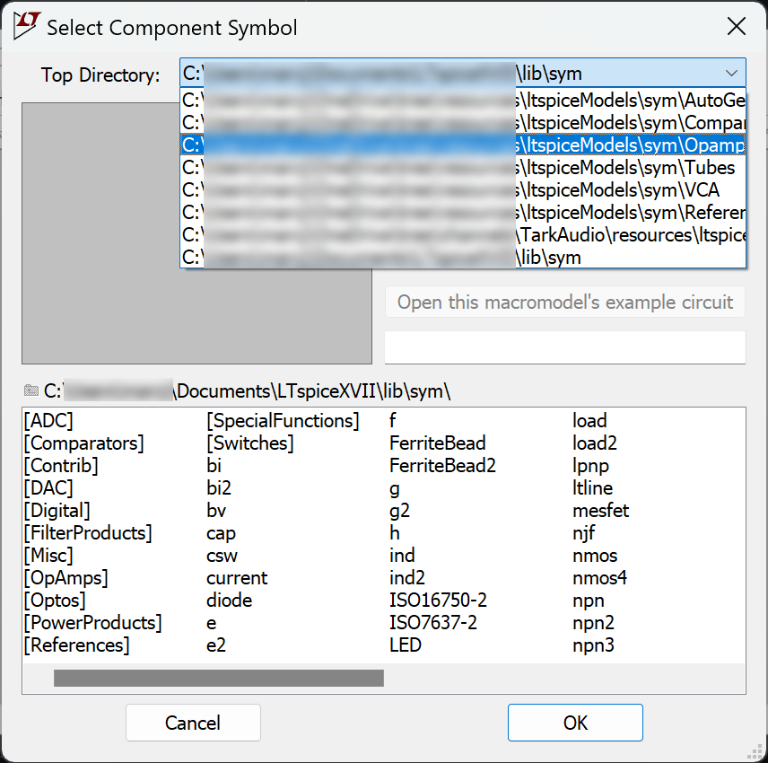

# ltspiceModels
Repo to house LtSpice models used in Tark Audio designs.
 
 

# Installation
1) Download or clone the repo and place somewhere in your file system.

2) In LtSpice, click the Hammer Icon and navigate to the "Sym. & Lib. Search Path" tab.

3) Add the sym and sub folders to the search path as shown in the following image:

4) Click "OK".
 
 

# Usage
When adding a part, select the desired path in the "Top Directory"

